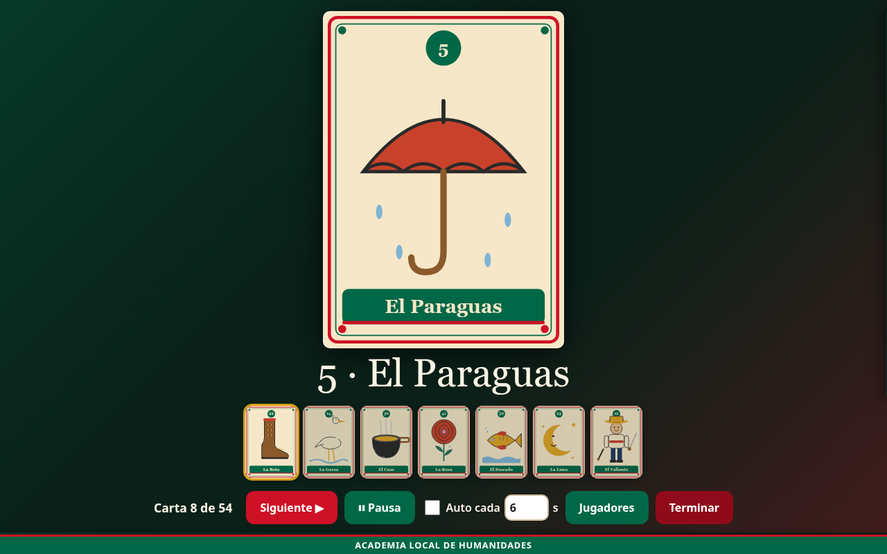
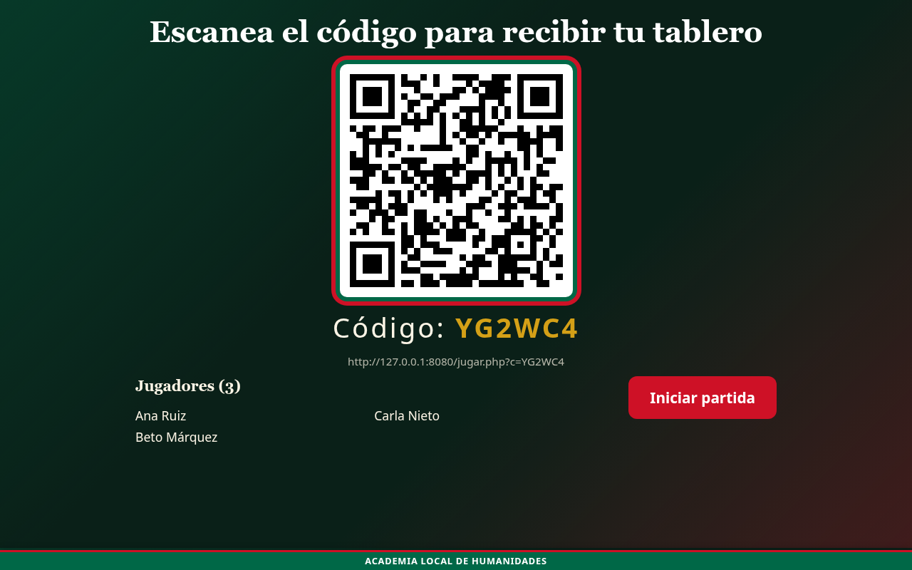
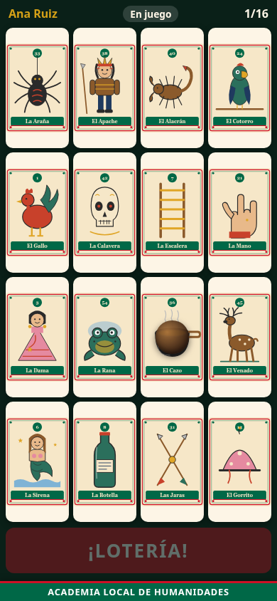
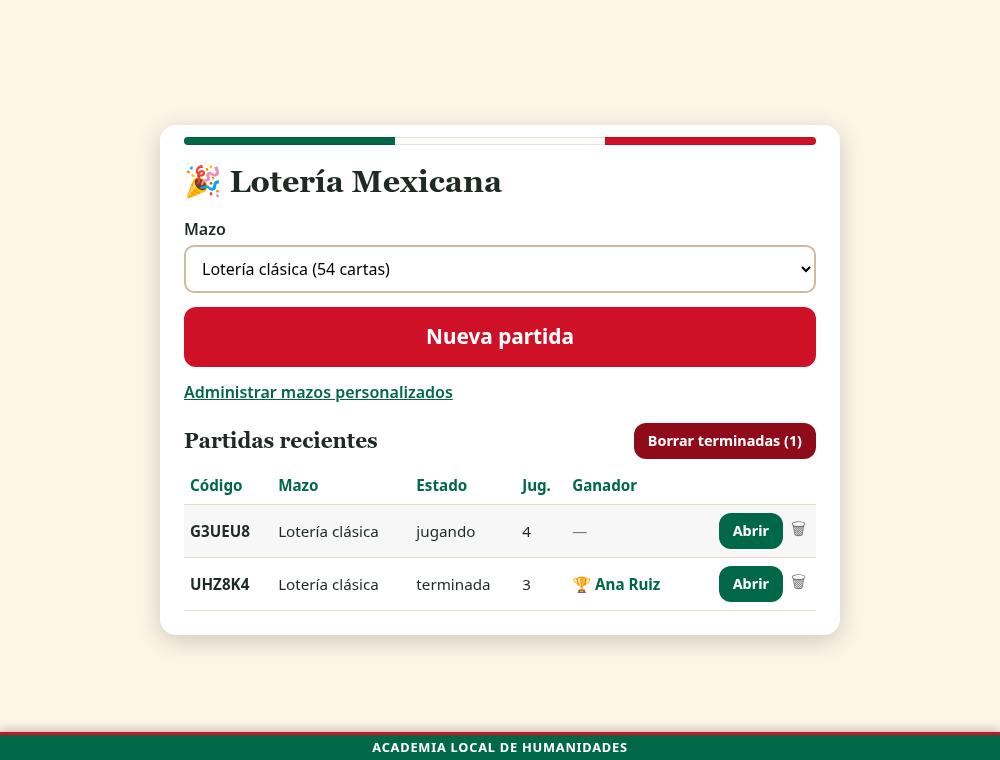

# 🎉 Lotería Mexicana

> *Dedicado a mi hermosa esposa Mayeli y a nuestro bebé.*

Juego de Lotería para el salón de clases. Una **pantalla grande** canta las cartas y los alumnos marcan su tablero **desde su teléfono**, sin instalar nada: entran escaneando un código QR.

[](https://www.gnu.org/licenses/gpl-3.0)
[](https://www.php.net/)
[](#por-qué-php-plano)



## Qué hace

- **Reparte los tableros con un QR.** El profesor proyecta el código y cada quien entra con su nombre. No hay registro ni contraseñas para los jugadores.
- **Canta las cartas en grande**, manualmente o con temporizador, con la tira de las últimas que salieron.
- **Valida cada marca en el servidor.** Un jugador no puede marcar una carta que todavía no ha salido: el teléfono solo vibra y la carta se sacude, sin decir por qué.
- **No da pistas.** El teléfono no muestra la carta actual ni resalta las que ya salieron, así que hay que estar atento a la pantalla.
- **Verifica el grito de lotería.** El botón se habilita al llenar el tablero; el servidor comprueba que las 16 cartas hayan salido de verdad y la pantalla grande anuncia **VÁLIDO** o **FALSA ALARMA**.
- **Lleva el registro** de jugadores, marcas y ganadores, y lo muestra en la portada.
- **Dos mazos.** El clásico de 54 cartas, con ilustraciones propias en SVG, y los que tú crees con tus propios conceptos.

### Mazos personalizados

Sirve para repasar cualquier materia: crea un mazo con los conceptos del tema y juega lotería con ellos. Cada carta lleva número, nombre e imagen opcional. Si no le pones imagen, se dibuja el nombre sobre un color. Con 16 cartas ya se puede jugar.

## Cómo se ve

| Reparto de tableros | Tablero en el teléfono |
|---|---|
|  |  |



## Instalación en un hosting con cPanel

1. Sube el contenido de este repositorio a una carpeta de tu sitio, por ejemplo `public_html/loteria`.
2. Crea una base de datos MySQL vacía, con su usuario y contraseña. **No hace falta importar ningún SQL**: las tablas y el mazo clásico se crean solos en la primera visita.
3. Copia `config.example.php` como `config.local.php` y escribe ahí tus datos de conexión.
4. Da permiso de escritura a la carpeta `uploads/`, que guarda las imágenes de los mazos personalizados.
5. Abre `https://tu-dominio/loteria/`.

Si algo falla en la conexión, la propia página te dice qué archivo busca y si lo encontró.

## Instalación en Railway

Railway detecta el `Dockerfile` incluido. Agrega un servicio MySQL al proyecto y define estas variables en el servicio web:

| Variable | Valor |
|---|---|
| `DB_DSN` | `mysql:host=${{MySQL.MYSQLHOST}};port=${{MySQL.MYSQLPORT}};dbname=${{MySQL.MYSQLDATABASE}};charset=utf8mb4` |
| `DB_USER` | `${{MySQL.MYSQLUSER}}` |
| `DB_PASS` | `${{MySQL.MYSQLPASSWORD}}` |
| `PRESENTADOR_CLAVE` | recomendada, porque la URL es pública |
| `BASE_URL` | opcional, el dominio público de la app |

Ten en cuenta que en Railway la carpeta `uploads/` se borra en cada despliegue, salvo que montes un volumen en `/var/www/html/uploads`.

## Cómo se juega

1. En la portada eliges el mazo y pulsas **Nueva partida**. Se abre la pantalla del presentador con el QR.
2. Los alumnos escanean, escriben su nombre y reciben un tablero distinto cada uno. No se admiten dos nombres iguales en la misma partida: la comparación ignora mayúsculas, acentos y espacios de más.
3. Pulsas **Iniciar partida**. A partir de ahí ya no entra nadie más.
4. **Siguiente** canta una carta. También sirven la barra espaciadora y la flecha derecha. **Auto** avanza sola cada N segundos y **P** pausa.
5. Al llenar su tablero, el jugador pulsa **¡LOTERÍA!** y muestra su teléfono. Tú decides si terminas la partida o si el juego continúa.
6. Si un teléfono se recarga o se bloquea, recupera su tablero y sus marcas al volver a abrir la página.

La portada lista las partidas recientes con su estado y su ganador, y permite borrarlas una por una o todas las terminadas de golpe.

## Configuración

Todo se ajusta en `config.php`, o mejor en tu `config.local.php` para no tocar el archivo original:

Los valores por defecto viven en `lib/constantes.php`, así que una instalación que conserve un `config.php` de una versión anterior sigue funcionando cuando el programa estrena una opción nueva.

| Constante | Para qué sirve |
|---|---|
| `DB_DSN`, `DB_USER`, `DB_PASS` | Conexión a la base de datos. |
| `PRESENTADOR_CLAVE` | Si no está vacía, protege portada, presentador y mazos. Entras una vez con `?k=tu-clave` y queda en una cookie. |
| `INSTITUCION` | Texto de la cintilla inferior. Vacío la oculta. |
| `INTERVALO_SONDEO_MS` | Cada cuánto consultan el servidor la pantalla y los teléfonos. |
| `BASE_URL` | URL pública, si la que deduce PHP no es la correcta. |

## Desarrollo

```bash
# Servidor local con SQLite: no necesita MySQL ni tu config.local.php
php -S 127.0.0.1:8080 tools/dev-router.php

# Pruebas (usan SQLite en memoria)
php tests/run.php

# Regenerar los 54 SVG del mazo clásico
php tools/generar_cartas.php
```

### Cómo está organizado

| Ruta | Qué contiene |
|---|---|
| `index.php` | Portada: crear partidas, verlas y borrarlas. |
| `presentador.php` | Pantalla grande: QR, carta cantada y controles. |
| `jugar.php` | Tablero del teléfono. |
| `mazos.php` | Panel de mazos personalizados. |
| `api.php` | Único punto de entrada JSON, con `?a=accion`. |
| `lib/juego.php` | Lógica pura: barajar, armar tableros, validar marcas y loterías. |
| `lib/constantes.php` | Valores por defecto de toda la configuración. |
| `lib/api_*.php` | Acciones del API por área. |
| `cartas/` | Los 54 SVG del mazo clásico. |
| `tests/` | Pruebas del juego y del API. |
| `docs/diseno.md` | Documento de diseño con las decisiones tomadas. |

### Por qué PHP plano

El destino es un hosting compartido con cPanel, donde no hay Node, ni Composer, ni WebSockets. Por eso todo es PHP con PDO y JavaScript sin librerías, y el tiempo real se resuelve con un sondeo cada segundo y medio, que con un grupo entero de alumnos es carga insignificante. La única dependencia externa es `qrcode.js`, incluida en el repositorio.

## Créditos

La **idea, el diseño del juego y las decisiones de producto** son de **Ismael A. Acevedo Rendón**: cómo se reparten los tableros, que la validación viva en el servidor, que el teléfono no dé pistas para obligar a estar atento, el registro de jugadores y ganadores, y la identidad visual de fiestas patrias.

El **código fue generado íntegramente con [Claude Code](https://claude.com/claude-code)** (Anthropic), a partir de esas indicaciones y en diálogo con el autor. No se escribió a mano ninguna línea del programa: cada archivo, incluidas las 54 ilustraciones en SVG y las pruebas automatizadas, se produjo en esa conversación de trabajo.

Los nombres y la numeración de las cartas son los tradicionales de la Lotería mexicana, de dominio público. Las ilustraciones son originales de este proyecto y no reproducen el arte de ninguna baraja comercial.

## Licencia

Este programa es software libre bajo la **Licencia Pública General GNU, versión 3** o posterior. Puedes usarlo, estudiarlo, compartirlo y modificarlo; si distribuyes una versión modificada, debe conservar esta misma licencia. El texto completo está en [LICENSE](LICENSE).

Se distribuye sin ninguna garantía. Consulta la licencia para los detalles.
